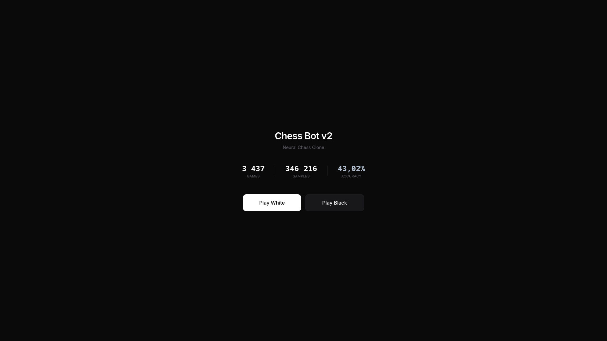
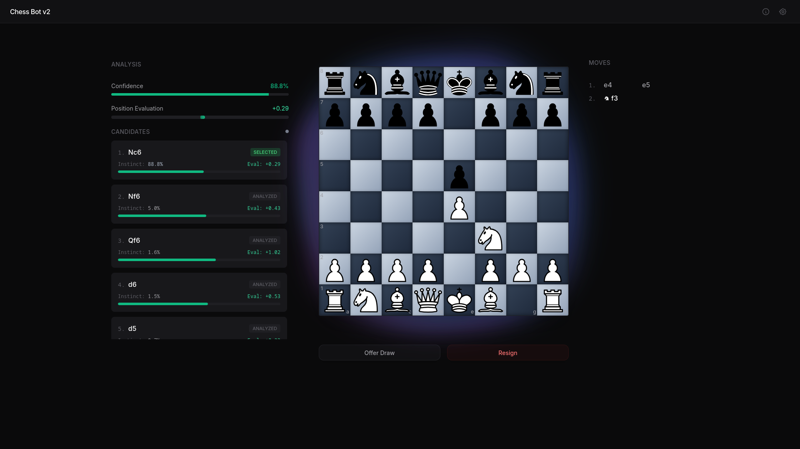
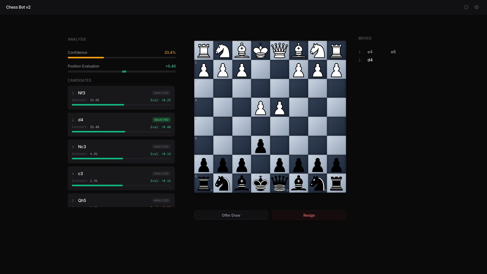

# ResNet Chess Engine (v2)

ResNet Chess Engine is a behavioral clone trained on 3,437 games (346,000+ positions). Unlike traditional engines that seek optimal play, this model replicates the intuition and pattern recognition of my playstyle while enforcing safety through a custom Veto system.

## Visual Interface





---

## Evolution
This project has transitioned from a Stockfish dependent wrapper (v1) to a fully custom neural architecture (v2):
* Custom Neural Backbone: 15-block Squeeze-and-Excitation ResNet.
* Hardware Optimized: Developed on Arch Linux using CUDA-accelerated batched inference.
* Responsive Interface: A React/Vite dashboard using Tailwind CSS and CSS Grid.

---

## Engine Architecture

| Component | Engineering Detail |
|---|---|
| Backbone | SE-ResNet15 (15 Residual Blocks, Squeeze-and-Excitation attention, 192 channels) |
| Dual-Head | Policy Head (Move Probability) and Value Head (Position Evaluation) |
| Inference | Batched 1-Ply Search (Future positions processed as (K, 19, 8, 8) tensors) |
| Input Encoding | 19-plane (8x8) tensor covering pieces, castling, en passant, and move data |

### Veto Decision Logic
1. Instinct Selection: The Policy Head identifies the Top 5 moves based on trained patterns.
2. Tactical Injection: Legal captures are generated and sorted by material value.
3. Parallel Evaluation: Up to 10 candidate moves are processed in a single GPU forward pass via the Value Head.
4. The Veto: Moves that result in a position evaluation drop exceeding 100 centipawns (calculated via atanh scaling) are discarded.
5. Move Execution: A weighted sample is taken from the surviving candidates to preserve style while preventing blunders.

---

## Tech Stack

* AI/ML: PyTorch (CUDA), NumPy, SE-ResNet Architecture.
* Backend: FastAPI, Uvicorn (Inference Server), Pydantic.
* Frontend: React 18, Vite, Tailwind CSS, Lucide Icons.
* Chess Logic: python-chess (server) and chess.js (client).

---

## Installation

### 1. Backend Server (FastAPI + PyTorch)
Ensure you have Python 3.10+ installed. Open a terminal and run:

```bash
pip install -r requirements.txt
uvicorn main:app --host 0.0.0.0 --port 8000
```

### 2. Frontend Application (React + Vite)
Ensure you have Node.js installed. Open a second terminal window and run:

```bash
cd chess-frontend
npm install
npm run dev
```

### 3. Quick Start (Linux)
If you are on a Unix-based system, you can initialize both the frontend and backend simultaneously using the provided script:

```bash
chmod +x run_project.sh
./run_project.sh
```

---

## Training Your Own Clone

The model uses a dual-loss objective: Loss = PolicyLoss + 5.0 * ValueLoss. It uses OneCycleLR for rapid convergence and label smoothing (0.1) to prevent over-fitting.

To train the engine on your own dataset:

```bash
# 1. Parse your raw PGN games into 19-layer bitboards
python data_miner.py

# 2. Train the SE-ResNet15 model
python train_model.py
```

---

## Training
The model uses a dual-loss objective: Loss = PolicyLoss + 5.0 * ValueLoss.

* Optimizer: OneCycleLR for rapid convergence during the 346k position training phase.
* Data Processing: Raw PGN data is parsed into 19-layer bitboards via data_miner.py.
* Performance: Batched tensor search allows for 1-ply depth with near-zero latency on modern GPUs.

---

Created by Piyush Singh
